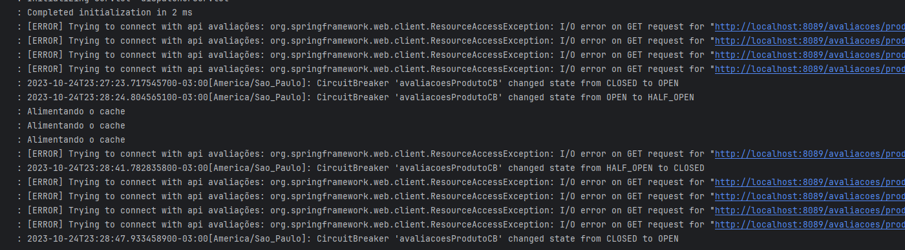

# API de Produtos e API de Avaliações
Objetivo principal: Entender o conceito de circuitbreaker e implementá-lo utilizando Resilience4j e Spring Boot.<br>
*Obs:* Produtos e avaliações são salvos no banco de dados MariaDB.

<h2>O que você vai precisar?</h2>
- Docker

<h2>Rodando: Passo a passo</h2>
1) Rodar a linha abaixo.
```
docker-compose up
```
Vai criar um container e subir a imagem do banco de dados MariaDB, esse banco vai estar exposto na porta 3307.

2) Rodar o ProdutosApplication
3) Rodar a AvalicaoApplication
4) Cadastrar alguns produtos e algumas avaliações
5) Parar a aplicação de avaliação
6) Testar com ids de produtos diferentes a request 3
7) Alguns casos vão cair no cache e em outros será retornado o erro 500
8) Observar os logs no console informando que o circuitbreaker está aberto, fechado ou meio-aberto

No application.properties foram definidas as seguintes propriedades:
````
resilience4j.circuitbreaker.instances.avaliacoesProdutoCB.baseConfig=default
resilience4j.circuitbreaker.configs.default.minimumNumberOfCalls=4
resilience4j.circuitbreaker.configs.default.slidingWindowSize=8
````
Elas informam que quando 4 chamadas forem feitas, através do método que possui o
circuitbreaker annotation 'avaliacoesProdutoCB', e essas chamadas não obtiverem resposta da outra API o circuitbreaker será fechado. <br><br>
O método que chama a API de avaliações está na classe 'AvaliacoesDoProdutoService.java' e o método é o getAllAvaliacoes.
````
@CircuitBreaker(name="avaliacoesProdutoCB", fallbackMethod = "getAllAvaliacoesNoCache")
public List<Avaliacao> getAllAvaliacoes(Long idProduto) throws Exception {
    //....
}
````

<h2>Requests</h2>
1) Cadastrar produto
````
curl --request POST \
  --url http://localhost:8088/produto \
  --header 'Content-Type: application/json' \
  --header 'User-Agent: insomnia/8.3.0' \
  --data '{
	"nome":"Produto 1"
}'
````

2) Cadastrar avaliação
````
curl --request POST \
  --url http://localhost:8089/avaliacoes \
  --header 'Content-Type: application/json' \
  --header 'User-Agent: insomnia/8.3.0' \
  --data '{
	"nota": 2,
	"descricao": "descricao aqui",
	"idProduto": 1
}'
````

3) Listar todas as avaliações do produto de id=1
````
curl --request GET \
  --url http://localhost:8088/produtos/1/avaliacoes \
  --header 'User-Agent: insomnia/8.3.0'
````

<h2>Links úteis</h2>
- Documentação do Resilience4j: https://resilience4j.readme.io/docs/circuitbreaker <br>
- Para a dependência do Resilience4j: https://mvnrepository.com/artifact/io.github.resilience4j/resilience4j-spring-boot2 <br>
- Para a dependência do actuator: https://mvnrepository.com/artifact/org.springframework.boot/spring-boot-starter-actuator <br>
- Para a dependência do Spring AOP: https://mvnrepository.com/artifact/org.springframework/spring-aop <br>
